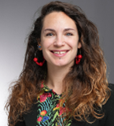
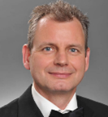

## The Team

### Dr. Nicki Barbour  

Dr Nicki Barbour is an Assistant Professor at Towson University and runs the “Barbour Movement Ecology Lab” (BMEL), where she mentors students in wildlife research.   

---

### Dr. Harald Beck 

Dr Harald Beck is a Professor at Towson University and has previously used camera-trapping to research mammals in the Amazon and in Maryland.  

### Contact Us

We would love to hear from you! 

Question? Concerns? Email Baltimore City Canid Project below, we will respond ASAP.

[📧 Email Baltimore City Canid Project](mailto:baltimorecitycanidproject@gmail.com)

