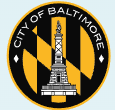

::: {.columns}

::: {.column width="50%"}

### Dr. Nicki Barbour
**Lead Principal Investigator**  

Dr Nicki Barbour is an Assistant Professor at Towson University and runs the “Barbour Movement Ecology Lab” (BMEL), where she mentors students in wildlife research.   

:::

::: {.column width="50%"}

### Dr. Harald Beck
**Co-Principal Investigator**

Dr Harald Beck is a Professor at Towson University and has previously used camera-trapping to research mammals in the Amazon and in Maryland. 

:::

:::

---

## Research Partners and Collaborators

We work with a variety of amazing collaborators that collectively make this research possible, including:

### Baltimore City Recreation and Parks (BCRP)

{width="200px"}

### The Urban Wildlife Information Network (UWIN)

{width="200px"}

---

## Contact Us

We would love to hear from you! 

Question? Concerns? Email the Baltimore City Canid Project below!

[📧 Email Baltimore City Canid Project](mailto:baltimorecitycanidproject@gmail.com)

