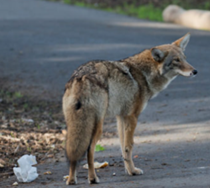
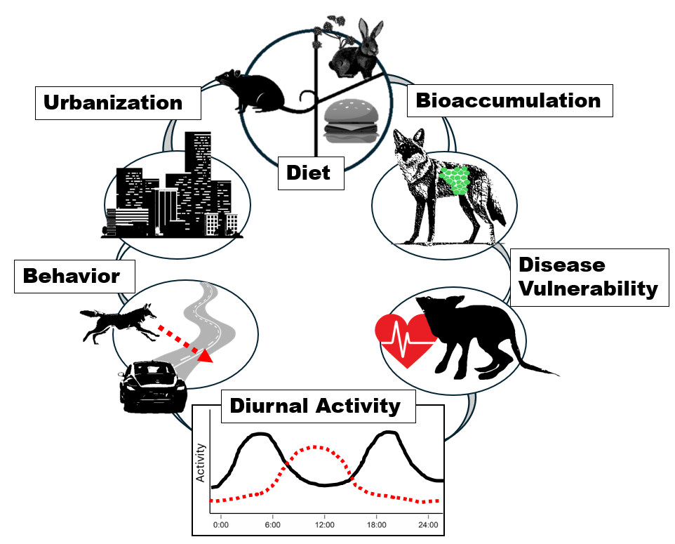
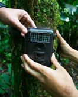

## Canids in the City

{.img-left}
*Coyote in a MD city. Photo from Maryland Fur Trappers.*

As human populations continue to grow, we see increasing impacts on wildlife. Some wildlife, such as coyotes and red foxes, have adapted to live alongside humans. But this can come at a cost, as living in densely populated urban areas like Baltimore City can put them at risk for eating contaminated food, getting hit by cars, and having other harmful interactions with humans. 

## What's the Baltimore City Canid Project?

Scientists at Towson University want to learn more about canids such as coyotes and foxes in the City. They want to answer questions such as: How many canids of each species are there? What times of day are they most active and does this put them at risk for interacting with humans? Are canids in the city healthy?

{.img-right}
*Positive feedback loop between urbanization and canid health. Canids in urban areas may have a higher proportion of nuisance rodents in their diet, which may have higher concentrations of poisons (rodenticides) that can bioaccumulate and put canids at risk of disease. Diseased canids may have altered behavior, including being more active during the day and more likely to cross busy roads.*

To do this, scientists have placed motion sensor cameras in various green spaces throughout the City. These cameras will be attached to trees in areas where wildlife might be and will trigger to take a photo when an animal passes in front. Photos are then labeled in the lab by experts to determine how many of each wildlife species there are in an area. Although the study will target canids, we likely will also get pictures of white-tailed deer, squirrels, and other native wildlife!

{.img-right}
*Wildlife camera attached to a tree. Photo from UWIN.*

This study will be part of a national study on urban wildlife, the **Urban Wildlife Information Network (UWIN)** (https://www.urbanwildlifeinfo.org/). UWIN protocols will be used to collect data, with cameras being put out for about a month in April, July, October, and December. 

This will also be a student-involved project, and both undergraduate and graduate students at Towson University will be helping to collect and analyze data! 

## Common Questions & Answers

### How do the cameras work?

The cameras detect motion from living things using passive infrared sensors, which detect infrared energy (heat) from living organisms. The cameras are set to take photos whenever triggered, storing the data on an SD card that can be uploaded for analysis in the lab.

### Do you record humans on these cameras? 

Cameras will detect humans if they pass in front but we do not keep any images of humans. If you have any concerns about this, please reach out to us at [baltimorecitycanidproject@gmail.com](mailto:baltimorecitycanidproject@gmail.com). 

### Is it normal to see canids during the day?

Canids that are adapted to living with humans may sometimes be more "bold" and/or be active during odd times of day. While this is sometimes a sign of disease (e.g., mange) it can also just be due to canids adapting to city life.

### Will coyotes attack me, my kids, or my dog?

Coyotes are much more shy than most people think. They don't like interacting with people and usually will avoid people by being more active in the later parts of the day (evening, night) and using greenspaces without people. They also do not actively target their hunting towards people's pets and their main prey is small wild mammals like rabbits and rodents, birds, and occasionally deer.

Although you do not need to be scared of being attacked by coyotes, **you or your children should never approach a wild coyote, loose dog, or any other canid you encounter in the City.**

