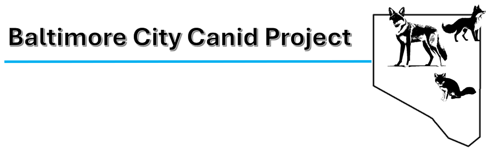

## Canids in the City

As human populations continue to grow, we see increasing impacts on wildlife. Some wildlife, such as coyotes and red foxes, have adapted to live alongside humans. But this can come at a cost, as living in densely populated urban areas like Baltimore City can put them at risk for eating contaminated food, getting hit by cars, and having other harmful interactions with humans. 

## What's the Baltimore City Canid Project?

Scientists at Towson University want to learn more about canids such as coyotes and foxes in the City. They want to answer questions such as: How many canids of each species are there? What times of day are they most active and does this put them at risk for interacting with humans? Are canids in the city healthy?

To do this, they are planning to use motion sensor cameras in various green spaces throughout the City. These cameras will be attached to trees in areas where wildlife might be and will trigger to take a photo when an animal passes in front. Photos are then labeled in the lab by experts to determine how many of each wildlife species there are in an area. Although the study will target canids, we likely will also get pictures of white-tailed deer, squirrels, and other native wildlife!

This study will be part of a national study on urban wildlife, “The Urban Wildlife Information Network” (UWIN). UWIN protocols will be used to collect data, with cameras being put out for about a month in April, July, October, and December. 

This will also be a student-involved project, and both undergraduate and graduate students at Towson University will be helping to collect and analyze data! 

