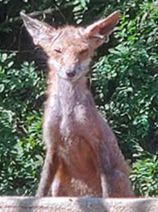

Did you see a canid in Baltimore City? Use the Google form below to tell us about your observation! 

[Report a Canid Form](https://docs.google.com/forms/d/e/1FAIpQLSf6pvJl_Z8ZYNwEviXHC3q4v2fmsv1I2vn-pDvEoso4ZB4U8g/viewform?usp=header)

Alternatively, you can also email us at [baltimorecitycanidproject@gmail.com](mailto:baltimorecitycanidproject@gmail.com) and tell us about your encounter! Please include the date, time, location, any photos, and any description of the canid's health and behavior. 

## What are the "Canids"?

Canids can include red foxes (*Vulpes vulpes*), gray foxes (*Urocyon cinereoargentius*), coyotes (*Canis latrans*), or even off-leash domestic dogs. To help ID a specific canid for your report, use the following guide:

### **Red Fox**

Key characteristics include a reddish-brown coat, bushy tail with a white tip, upright triangular ears, long muzzle, and long legs with black coloration. Red foxes are particularly vulnerable to mange and when infected, will often look hairless and skinny.

{fig-cap="Red fox. Photo from the Maryland Department of Natural Resources."}

{fig-cap="Red fox with mange. Photo from the Maryland Department of Natural Resources."}

### **Gray Fox**

Key characteristics include a more "cat-like" appearance compared to red foxes, with gray foxes having smaller bodies, shorter legs, shorter/small muzzles, rusty gray coat, and a shorter tail with a black tip.

{fig-cap="Gray fox. Photo from the Maryland Department of Natural Resources."}

### **Coyote**

Key characteristics include long pointy ears, long muzzles, long legs, long tail, and sandy brown coat. They often are confused with German Shepherds and are much larger than foxes.

{fig-cap="Coyote. Photo from the Maryland Department of Natural Resources."}

