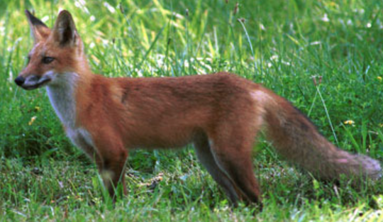
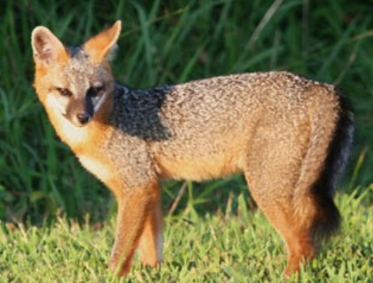
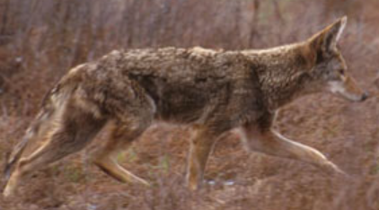

Did you see a canid in Baltimore City? Use the Google form below to tell us about your observation!

```{=html}
<a href="https://docs.google.com/forms/d/e/1FAIpQLSf6pvJl_Z8ZYNwEviXHC3q4v2fmsv1I2vn-pDvEoso4ZB4U8g/viewform?usp=header" class="btn-primary" target="_blank">
  Report a Canid Sighting
</a>
```

Alternatively, you can also email us:

```{=html}
<a href="mailto:baltimorecitycanidproject@gmail.com" class="btn-primary">📧 Email Us</a>
```

When emailing, please include the date, time, location, any photos, and any description of the canid's health and behavior.

## What are the "Canids"?

Canids can include red foxes (*Vulpes vulpes*), gray foxes (*Urocyon cinereoargentius*), coyotes (*Canis latrans*), or even off-leash domestic dogs. To help ID a specific canid for your report, use the following guide:

<br>

---

### **Red Fox**

Key characteristics include a reddish-brown coat, bushy tail with a white tip, upright triangular ears, long muzzle, and long legs with black coloration. Red foxes are particularly vulnerable to mange and when infected, will often look hairless and skinny.

```{=html}
<div class="img-left-wrap">
  
  <div class="caption">Red fox. Photo from the Maryland Department of Natural Resources.</div>
</div>
<div class="clear"></div>
```

---

### **Gray Fox**

Key characteristics include a more "cat-like" appearance compared to red foxes, with gray foxes having smaller bodies, shorter legs, shorter/small muzzles, rusty gray coat, and a shorter tail with a black tip.

```{=html}
<div class="img-left-wrap">
  
  <div class="caption">Gray fox. Photo from the Maryland Department of Natural Resources.</div>
</div>
<div class="clear"></div>
```

---

### **Coyote**

Key characteristics include long pointy ears, long muzzles, long legs, long tail, and sandy brown coat. They often are confused with German Shepherds and are much larger than foxes.

```{=html}
<div class="img-left-wrap">
  
  <div class="caption">Coyote. Photo from the Maryland Department of Natural Resources.</div>
</div>
<div class="clear"></div>
```
